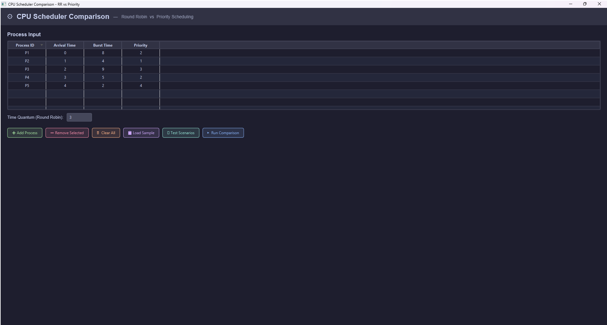
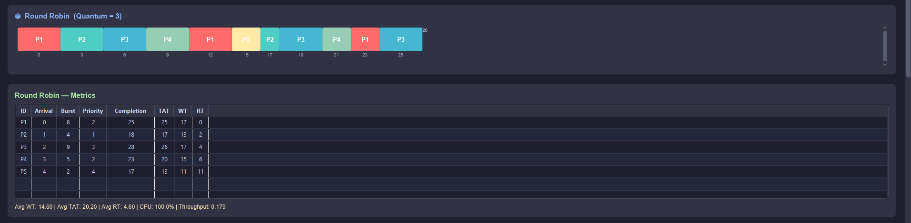
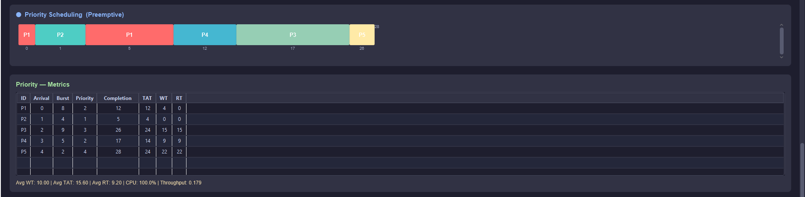
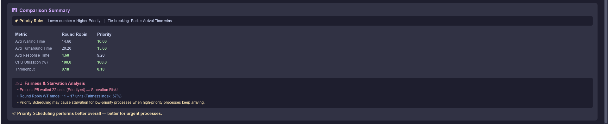

# CPU Scheduler Comparison
## Round Robin vs Priority Scheduling


---

## 📋 Project Description

This project is part of the **Operating Systems Course** at Helwan University.  
It implements and compares two CPU scheduling algorithms:

- **Round Robin (RR)** — A preemptive algorithm that gives each process a fixed time quantum fairly.
- **Priority Scheduling** — A preemptive algorithm that always runs the highest-priority process first.

The application allows users to input custom processes, visualize execution via **Gantt Charts**, and compare performance metrics side by side.

---

## ✨ Features

- ✅ Interactive process input table (editable cells)
- ✅ Gantt Chart visualization for both algorithms
- ✅ Metrics calculation: **WT, TAT, RT, CPU Utilization, Throughput**
- ✅ Side-by-side comparison table with automatic winner highlighting
- ✅ Fairness & Starvation analysis
- ✅ Priority rule clearly stated: **Lower number = Higher Priority**
- ✅ Tie-breaking rule: **Earlier Arrival Time wins**
- ✅ Input validation with clear error messages
- ✅ 3 built-in test scenarios (Normal, Behavior-Revealing, Invalid Input)
- ✅ Load sample data instantly

---

## 🖥️ Screenshots

### Main Interface


### Round Robin Gantt Chart


### Priority Scheduling Gantt Chart


### Comparison Summary


---

## ⚙️ Requirements

- Java **21** or higher
- JavaFX **21.0.6**
- Maven **3.8+**
- IntelliJ IDEA (recommended)

---

## 🚀 How to Run

### Option 1: Using IntelliJ IDEA
```
1. Clone the repository
2. Open the project in IntelliJ IDEA
3. Wait for Maven to download dependencies
4. Run: src/main/java/com/scheduler/schedulercomparison/gui/MainApp.java
```

### Option 2: Using Maven Command Line
```bash
git clone https://github.com/mohamed1-0/SchedulerComparison.git
cd SchedulerComparison
mvn clean javafx:run
```

---

## 📁 Project Structure

```
SchedulerComparison/
├── src/
│   └── main/
│       ├── java/
│       │   └── com/scheduler/schedulercomparison/
│       │       ├── gui/
│       │       │   ├── MainApp.java          ← Entry point
│       │       │   ├── MainView.java         ← Main UI + Logic
│       │       │   ├── ProcessRow.java       ← Table row model
│       │       │   └── EditableCell.java     ← Editable table cell
│       │       ├── model/
│       │       │   ├── Process.java          ← Process data model
│       │       │   └── GanttEntry.java       ← Gantt chart entry
│       │       ├── scheduler/
│       │       │   ├── RoundRobinScheduler.java   ← RR algorithm
│       │       │   └── PriorityScheduler.java     ← Priority algorithm
│       │       └── metrics/
│       │           └── MetricsCalculator.java     ← WT, TAT, RT calculator
│       └── resources/
│           └── styles/
│               └── main.css                  ← Dark theme styling
├── screenshots/                              ← App screenshots
├── test-cases/                               ← Documented test scenarios
├── README.md
└── pom.xml
```

---

## 📊 Algorithms

### Round Robin (RR)
- **Type:** Preemptive
- **Selection:** FIFO queue with fixed time quantum
- **Strength:** Fair — every process gets equal CPU time
- **Weakness:** Higher average waiting time if quantum is too large

### Priority Scheduling (Preemptive)
- **Type:** Preemptive
- **Selection:** Highest priority (lowest number) runs first
- **Priority Rule:** Lower number = Higher Priority
- **Tie-breaking:** Earlier Arrival Time wins
- **Strength:** Urgent processes are served immediately
- **Weakness:** Low-priority processes may starve

---

## 📐 Metrics Calculated

| Metric | Formula |
|--------|---------|
| Turnaround Time (TAT) | Completion Time - Arrival Time |
| Waiting Time (WT) | TAT - Burst Time |
| Response Time (RT) | First CPU Time - Arrival Time |
| CPU Utilization | (Total Burst / Total Time) × 100% |
| Throughput | Processes Completed / Total Time |

---

## 🧪 Test Scenarios

### Scenario 1 — Normal Case
| Process | Arrival | Burst | Priority |
|---------|---------|-------|----------|
| P1 | 0 | 8 | 2 |
| P2 | 1 | 4 | 1 |
| P3 | 2 | 9 | 3 |
| P4 | 3 | 5 | 2 |
| P5 | 4 | 2 | 4 |

**Time Quantum = 3**

### Scenario 2 — Behavior-Revealing (Priority vs Fairness)
| Process | Arrival | Burst | Priority |
|---------|---------|-------|----------|
| P1 | 0 | 3 | 3 |
| P2 | 0 | 3 | 3 |
| P3 | 0 | 3 | 3 |
| P4 | 0 | 10 | 1 |
| P5 | 0 | 2 | 4 |

**Time Quantum = 2**

### Scenario 3 — Invalid Input Validation
Tests that the system rejects:
- Duplicate Process IDs
- Non-numeric values in numeric fields
- Burst Time = 0
- Priority = 0 or > 10
- Time Quantum ≤ 0

---

## 👥 Team Members

| No. | Name | ID | Contribution |
|-----|------|----|-------------|
| 1 | | | |
| 2 | | | |
| 3 | | | |

---

## 📝 Assumptions & Limitations

### Assumptions
- Priority rule: **Lower number = Higher Priority**
- Tie-breaking in Priority: **Earlier Arrival Time wins**
- Both algorithms use the **same workload** for fair comparison
- Maximum **10 processes** per simulation
- Burst Time range: **1 – 100**
- Priority range: **1 – 10**

### Limitations
- Does not support I/O bursts
- No aging mechanism for starvation prevention
- Single CPU simulation only

---

## 🎓 Course Information

- **Course:** Operating Systems
- **University:** Helwan University
- **Faculty:** Computer Science & Artificial Intelligence
- **Year:** 2024-2025